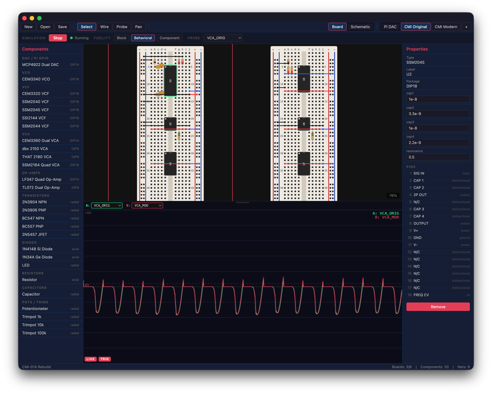
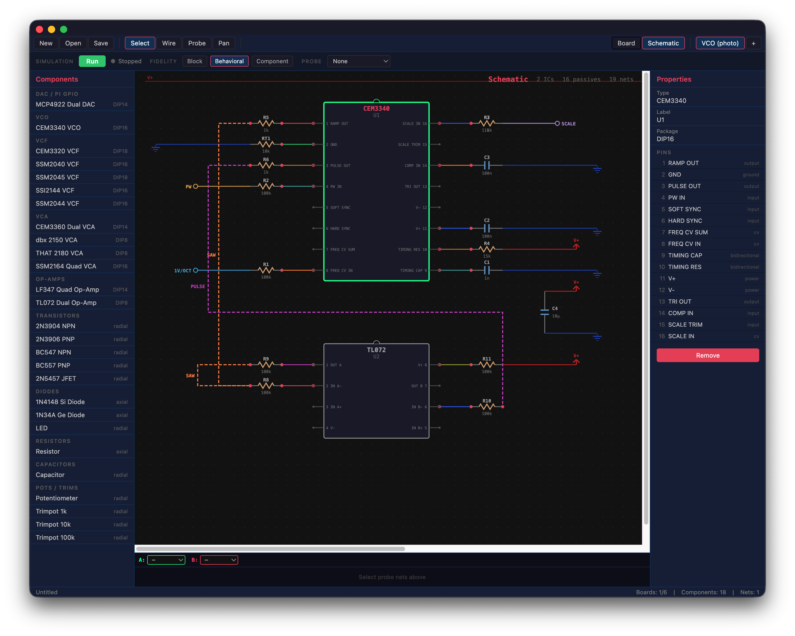

# bb830

Visual breadboard planning and circuit emulation for vintage synth voicecards.

    [](https://ko-fi.com/djw_audio)

bb830 is a cross-platform desktop app for designing analog synthesizer circuits on virtual BB830 breadboards, simulating them in real-time, and optionally connecting to a Raspberry Pi for hardware prototyping. Built for **AI-assisted circuit design** -- it exposes an MCP server so Claude can place components, wire circuits, run simulations, and probe signals directly alongside you.


*Multi-board breadboard view with dual A/B oscilloscope showing real-time filter comparison*


*Auto-generated schematic with IC blocks, passive symbols, and orthogonal signal routing*

## AI-Powered Circuit Design

bb830 is designed from the ground up for **collaborative circuit design with Claude**. Through the built-in MCP server, Claude can:

- **Place components** -- drop ICs, resistors, capacitors onto the breadboard by position
- **Wire circuits** -- connect pins with jumper wires, auto-route power and ground
- **Read circuit state** -- inspect the netlist, board layout, and component parameters
- **Run simulations** -- start the audio engine, probe any net, compare waveforms
- **Tune parameters** -- adjust component values in real-time and hear the difference
- **Build from schematics** -- recreate circuits from photos or PDFs of vintage designs

This means you can describe a circuit in natural language and Claude builds it live in the app, runs the simulation, and iterates on the design with you. For example: *"Build a CEM3340 VCO with timing components and probe the sawtooth output"* -- Claude places the IC, wires it up, starts the sim, and you hear the oscillator.

## Features

### Breadboard View
- Realistic BB830 breadboard with 63-row main grid, power rails, and center gap
- DIP IC packages straddle the center gap with accurate pin layouts
- Passive components (resistors, capacitors, diodes, transistors) with visual rendering
  - Resistors with 4-band color codes
  - Ceramic disc / electrolytic barrel capacitors
  - Diodes with cathode band and polarity triangle
  - TO-92 transistors with B/C/E labels
- Curved jumper wires with color selection
- Multi-board workspace (up to 6 boards for complex circuits)

### Schematic View
- Auto-generated SVG schematics from breadboard bus connections
- IC blocks with labeled pin stubs
- Inline passive symbols (zigzag resistors, plate capacitors, diode triangles)
- Terminal symbols (V+, GND, signal I/O)
- Column-based orthogonal routing with obstacle avoidance
- Per-board schematic scoping

### Circuit Simulation
- Real-time audio output via ScriptProcessorNode (AudioWorklet planned)
- Two fidelity levels:
  - **Block** -- ideal transfer functions, real-time++
  - **Behavioral** -- nonlinear curves, frequency-dependent saturation, real-time
- Dual A/B oscilloscope with phase-locked trigger
  - Probe A (green) and Probe B (red) overlaid
  - Net selector dropdowns for any probe point
  - Resizable scope with drag handle
  - Click to set trigger voltage level

### IC Model Library

| Category | Models |
|----------|--------|
| **VCO** | CEM3340 |
| **VCF** | CEM3320, SSM2040, SSM2044, SSM2045, SSI2144 |
| **VCA** | CEM3360, SSM2164, dbx 2150, THAT 2180 |
| **Op-Amp** | TL072 (dual), LF347 (quad) |
| **DAC** | MCP4922 (dual 12-bit SPI, Pi GPIO interface) |
| **Discrete** | NPN/PNP transistors (2N3904, 2N3906, BC547, BC557), JFET (2N5457) |
| **Diodes** | 1N4148, 1N34A (Ge), LED |
| **Passive** | Resistor, Capacitor, Potentiometer, Trimpots |

### MCP Server (Claude Integration)

The MCP server is the bridge between Claude and the live circuit designer. Claude sees the breadboard as a programmable canvas -- it can read the full circuit state, make changes, and observe results through the simulation engine. This enables workflows like:

- *"A/B compare an SSM2045 filter against an SSI2144 and tune the modern one to match"*
- *"Add a 10k feedback resistor from the op-amp output to the inverting input"*
- *"Sweep the filter cutoff from 200Hz to 5kHz and describe what you hear"*

Register it in your Claude Code project's `.mcp.json`:

```json
{
  "mcpServers": {
    "bb830": {
      "command": "npx",
      "args": ["tsx", "src/mcp/server.ts"]
    }
  }
}
```

**Available MCP tools:**

| Tool | Description |
|------|-------------|
| `bb830_place_component` | Place an IC or passive on the breadboard |
| `bb830_wire` | Connect two holes with a jumper wire |
| `bb830_remove` | Remove a component or wire |
| `bb830_set_parameter` | Set component value (resistance, capacitance, etc.) |
| `bb830_get_netlist` | Read the current circuit netlist |
| `bb830_get_board_state` | Get detailed board state |
| `bb830_list_components` | List available IC models and pinouts |
| `bb830_auto_ic` | Smart-place a DIP IC with auto power wiring |
| `bb830_auto_passive` | Smart-place a passive connected to an IC pin |
| `bb830_auto_wire` | Smart-wire between IC pins or to rails |
| `bb830_add_board` | Add a new board (max 6) |
| `bb830_new_project` | Create a new empty project |
| `bb830_derive_nets` | Auto-derive nets from breadboard bus connections |
| `bb830_run_sim` | Start simulation with probe net |
| `bb830_stop_sim` | Stop simulation |
| `bb830_get_nets` | List all nets |

### Raspberry Pi Connection (Planned)

- MCP4922 DAC model for SPI CV/audio output
- WebSocket/serial connection to Pi daemon
- GPIO mapping panel in UI
- Live hardware-in-the-loop testing

## Getting Started

### Prerequisites

- [Node.js](https://nodejs.org/) 18+
- [Git](https://git-scm.com/)

### Install & Run

```bash
git clone https://github.com/mo0kid/bb830.git
cd bb830
npm install
npm run dev
```

The app launches with an Electron window. The MCP server starts automatically on port 23340.

### Platform Notes

#### macOS
Works out of the box. Uses `hiddenInset` title bar for a native look.

#### Windows
Requires [Visual Studio Build Tools](https://visualstudio.microsoft.com/visual-cpp-build-tools/) for native Electron dependencies:
```powershell
npm install --global windows-build-tools   # if needed
git clone https://github.com/mo0kid/bb830.git
cd bb830
npm install
npm run dev
```

#### Linux
Install build essentials and display libraries:
```bash
# Debian/Ubuntu
sudo apt install build-essential libx11-dev libxkbfile-dev libsecret-1-dev

# Fedora
sudo dnf install gcc-c++ make libX11-devel libxkbfile-devel libsecret-devel

# Arch Linux
sudo pacman -S base-devel libx11 libxkbfile libsecret

git clone https://github.com/mo0kid/bb830.git
cd bb830
npm install
npm run dev
```

### Build for Distribution

```bash
npm run electron:build
```

Produces platform-specific installers (`.dmg` for macOS, `.exe`/`.msi` for Windows, `.AppImage`/`.deb` for Linux).

## Tech Stack

| Layer | Technology |
|-------|-----------|
| Runtime | Electron 33+ |
| Language | TypeScript |
| UI | React 19 + Zustand |
| Breadboard rendering | PixiJS 8 (WebGL/Canvas) |
| Schematic rendering | SVG via React |
| Audio engine | ScriptProcessorNode (Web Audio API) |
| MCP server | `@modelcontextprotocol/sdk` (stdio transport) |
| Build | Vite + electron-builder |

## Project Structure

```
bb830/
├── src/
│   ├── main/              # Electron main process
│   │   ├── index.ts       # App entry, window management
│   │   └── api-server.ts  # Local HTTP API (port 23340)
│   │
│   ├── renderer/          # React app
│   │   ├── App.tsx
│   │   ├── stores/        # Zustand state (circuit, sim, UI)
│   │   ├── views/         # Workspace, BreadboardView, SchematicView
│   │   └── panels/        # ComponentLibrary, PropertyEditor, WaveformDisplay
│   │
│   ├── engine/            # Simulation engine
│   │   └── simulator.ts   # Core simulation loop, dual A/B probe
│   │
│   ├── models/            # IC and component models
│   │   ├── types.ts       # ICModel interface, registry
│   │   ├── cem/           # CEM3340, CEM3320, CEM3360
│   │   ├── ssm/           # SSM2040, SSM2044, SSM2045, SSI2144, SSM2164
│   │   ├── generic/       # TL072, LF347, dbx2150, THAT2180, MCP4922
│   │   └── passive/       # Resistor, capacitor, potentiometer
│   │
│   ├── mcp/               # MCP server + layout engine
│   │   ├── server.ts      # MCP tool definitions
│   │   └── layout-engine.ts
│   │
│   └── shared/            # Shared types
│       ├── board-types.ts
│       ├── netlist-types.ts
│       └── project-schema.ts
```

## Adding IC Models

Create a new file in `src/models/` implementing the `ICModel` interface:

```typescript
import { type ICModel, type ModelState, Fidelity, registerModel } from '../types';

const myIC: ICModel = {
  type: 'MY_IC',
  name: 'My IC',
  pinCount: 8,
  stateSize: 2,
  supportedFidelity: [Fidelity.Block, Fidelity.Behavioral],

  createState(): ModelState {
    return {
      state: new Float64Array(2),
      outputs: new Float64Array(8),
    };
  },

  reset(state) { state.state.fill(0); state.outputs.fill(0); },

  process(state, inputs, params, dt, fidelity) {
    // Your DSP here — read inputs[], write to state.outputs[]
  },

  getOutput(state, pinIndex) {
    return state.outputs[pinIndex] ?? 0;
  },
};

registerModel(myIC);
export { myIC };
```

Then add the export to `src/models/index.ts` and a `ComponentDefinition` to `src/renderer/panels/ComponentLibrary.tsx`.

## License

[PolyForm Noncommercial 1.0.0](LICENSE) -- free for personal, educational, and non-commercial use. For commercial licensing, contact [mo0kid](https://github.com/mo0kid).
